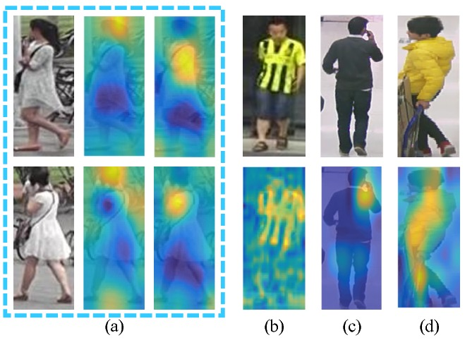
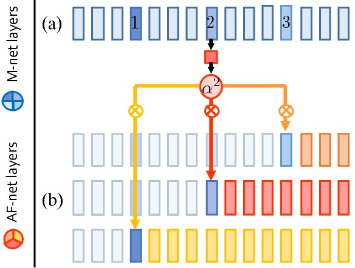
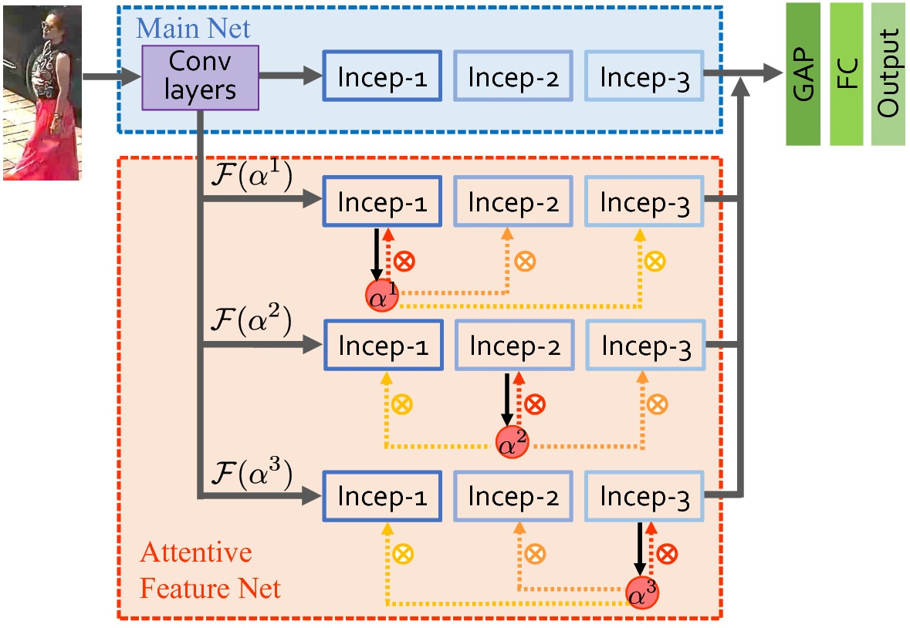
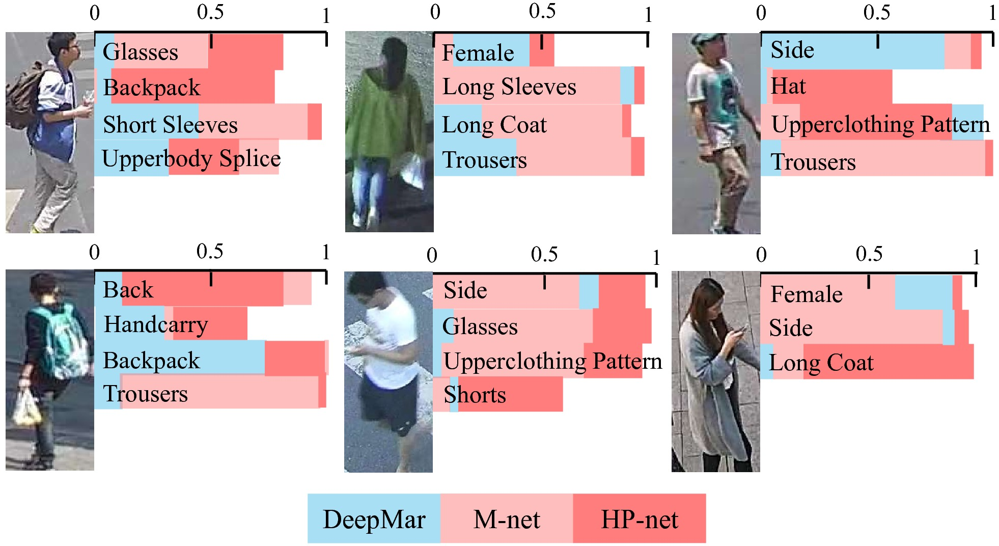
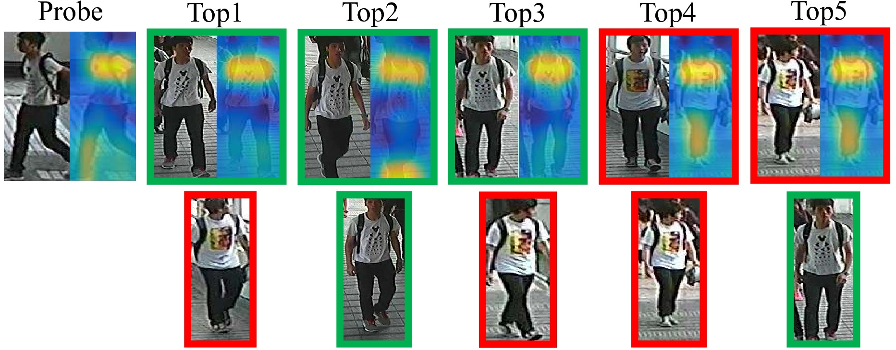

# HydraPlus-Net: Attentive Deep Features for Pedestrian Analysis


## Introduction

Pedestrian analysis is a long-lasting research topic because of the continuing demands for intelligent video surveillance and psychological social behavior researches. Particularly, with the explosion of researches about the deep convolutional neural networks in recent computer vision community, edestrian attribute recognition and person re-identification have received remarkable improvements and presented potentialities for practical usage in modern surveillance system. However, the learning of feature representation for pedestrian images, as the backbone for all those applications, still confronts critical challenges and needs profound studies. Previous approaches mainly generate global feature representations. We propose a multi-directional network, called HydraPlus-Net, to better exploit the global and local contents with multi-level feature fusion of a single pedestrian image. 

The figure below shows how multiple levels of feature patterns as well as a mixtrue of global and local information help with pedestrian analysis. For example, it is difficult to distinguish two instances if no semantic features are extracted around hair and shoulders, as shown in (a). Also in (c), the effective features should be located within a small-scale head-shoulder region if we want to detect the attribute calling. However, existing arts merely extract global features and are hardly effective to location-aware semantic pattern extraction. Furthermore, it is well-known that multi-level features aid diverse vision tasks. For example, the attribute clothing stride shown in (b) should be inferred from low-level features, while the attribute gender in (d) is judged by semantic understanding of the whole pedestrian image.



The contributions of this work:
* A HydraPlus Network (HP-net) is proposed with the novel multi-directional attention modules to train multi-level and multi-scale attention-strengthened features for fine-grained tasks of pedestrian analysis.
* The HP-net is comprehensively evaluated on pedestrian attribute recognition and person re-identification. State-of-the-art performances have been achieved with significant improvements against the prior methods.
* A new large-scale pedestrian attribute dataset (PA-100K dataset) is collected with the most diverse scenes and the largest number of samples and instances up-to-date. The PA-100K dataset is more informative than the previous collections and helpful for various pedestrian analysis tasks.


## HydraPlus-Net


### Multi-directional Attention



Multi-directional Attention module (MDA module) is a basic building block of the HydraPlus-Net. For each MDA module, there is one link of attention generation and three links for attentive feature construction. Different MDA modules have their attention maps generated from different inception blocks and then been multiplied to feature maps of different levels to produce multi-level attentive features. Applying one single attention map to multiple blocks naturally let the fused features encode multi-level information within the same spatial distribution.


### Overall Architecture



The HP-net consists of two parts, one is the **Main Net** (M-net) that is a plain CNN architecture, the other is the **Attentive Feature Net** (AF-net) including multiple branches of multi-directional attention (MDA) modules applied to different semantic feature levels.

Their outputs are concatenated and then fused by global average pooling (GAP) and fully connected (FC) layers. The final output can be projected as the attribute logits for attribute recognition or feature vectors for re-identification.


## Experiment Results

The proposed framework is evaluated on two representatives among the pedestrian analysis tasks, pedestrian attribute recognition and person re-identification (ReID). The HP-Net outperforms both M-Net and the previous state-of-the-art methods on the two tasks. Detailed quantitative results can be found in the paper, and some qualitative results are shown below. 

### Pedestrian Attribute Recognition



We show attribute recognition results for several exemplar pedestrian images. The bars indicate the prediction probabilities. Although the probabilities of one attribute do not directly imply its actual recognition confidences, they uncover the discriminative power of different methods as the lower probability corresponds to ambiguity or difficulty in correctly predicting one attribute. The proposed HP-net reliably predicts these attributes with region-based saliency, like glasses, back-pack, hat, shorts and handcarry.

### Person Re-identification



To highlight the performance of the proposed method on extracting localized semantic features, one query image together with its Top-5 gallery results by the proposed method and the M-net are visualized. For the probe images, the Top-5 retrieval results of HP-net together with attention maps are shown in the first row, and the results of M-net are shown in the second row. We observe that the proposed approach improves the rankings of the M-net and gets the correct results. By visualizing the attention maps from HP-Net of the query images and the Top-5 gallery images of both methods, we observe that the proposed attention modules can successfully locate the T-shirt patterns, in which the fine-grained features are extracted and discriminatingly identify the query person against the other identities with similar dressing.

## PA-100K Dataset

We release a new pedestrian attribute recognition dataset -- PA-100K dataset, which is larger and more informative than the previous datasets. It contains 100,000 pedestrian images annotated with 26 commonly used attributes including global attributes like gender, age, and object level attributes like handbag, phone, upper-clothing and etc. It surpasses the the previous datasets both in quantity and diversity.

The PA-100K dataset was constructed by images captured from real outdoor surveillance cameras which is more challenging. The samples of one person was extracted along its tracklets in a surveillance video, and they are randomly assigned to one of these sets, in which case PA-100K dataset ensures the attributes are learned independent of the person's identity. So this partition based on tracklets is fairer than the partition that randomly shuffles the images in PETA dataset.

The PA-100k dataset is under [CC-BY 4.0 license "Creative Commons — Attribution 4.0 International — CC BY 4.0"](https://creativecommons.org/licenses/by/4.0/).

[Download the dataset here!](https://drive.google.com/drive/folders/0B5_Ra3JsEOyOUlhKM0VPZ1ZWR2M?resourcekey=0-CdctEkdX1j2GSMSWWfrPSQ&usp=sharing)
[Baiduyun download link](https://pan.baidu.com/s/1l-5a__OTwZVkhm_A16HraQ)

## Contact Information

If you have any problems or questions, please feel free contact the authors.

Xihui Liu, xihui.liu.me@gmail.com or xihui-liu@link.cuhk.edu.hk

## Reference and Acknowledgements

If you use our dataset or code, please cite the following paper:

```
@inproceedings{liu2017hydraplus,
    Title = {HydraPlus-Net: Attentive Deep Features for Pedestrian Analysis},
    author = {Liu, Xihui and Zhao, Haiyu and Tian, Maoqing and Sheng, Lu and Shao, Jing and Yan, Junjie and Wang, Xiaogang},
    Booktitle = {Proceedings of the IEEE international conference on computer vision},
    pages={1--9},
    year={2017}
}

